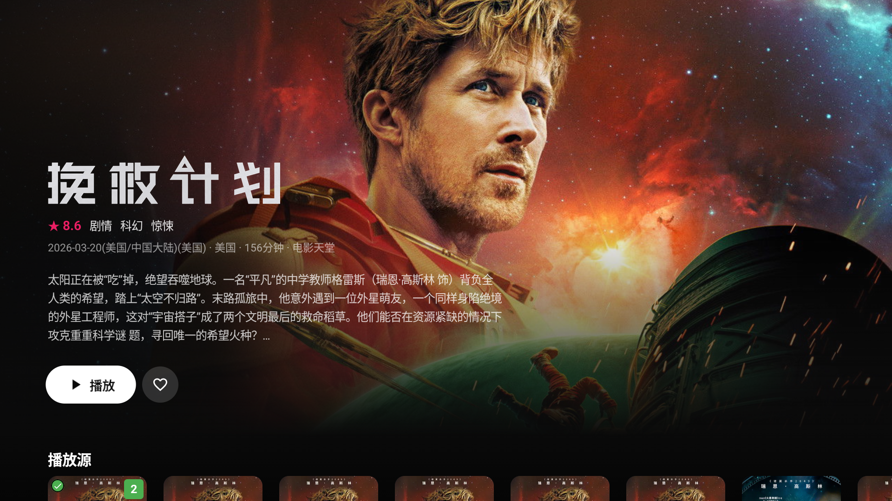
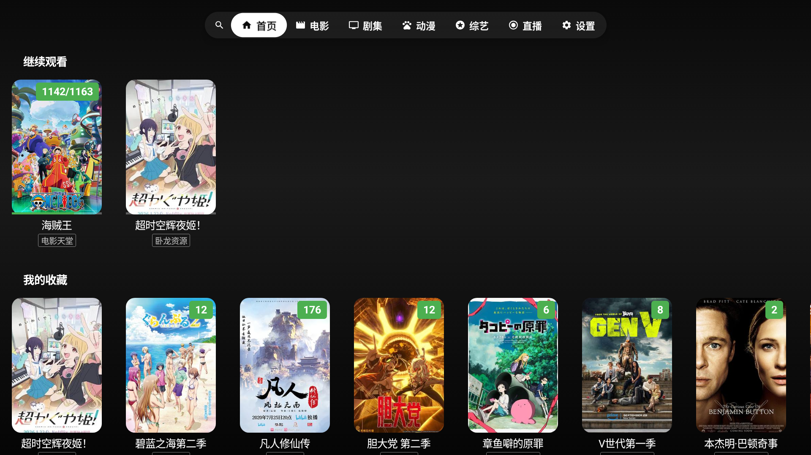
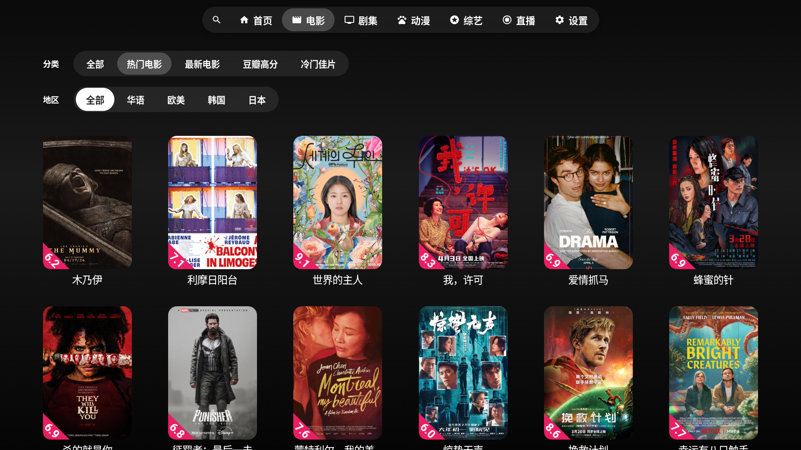
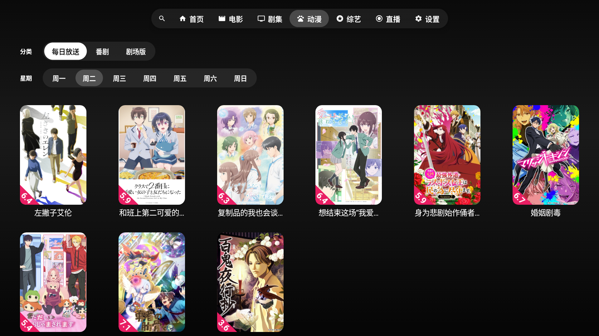
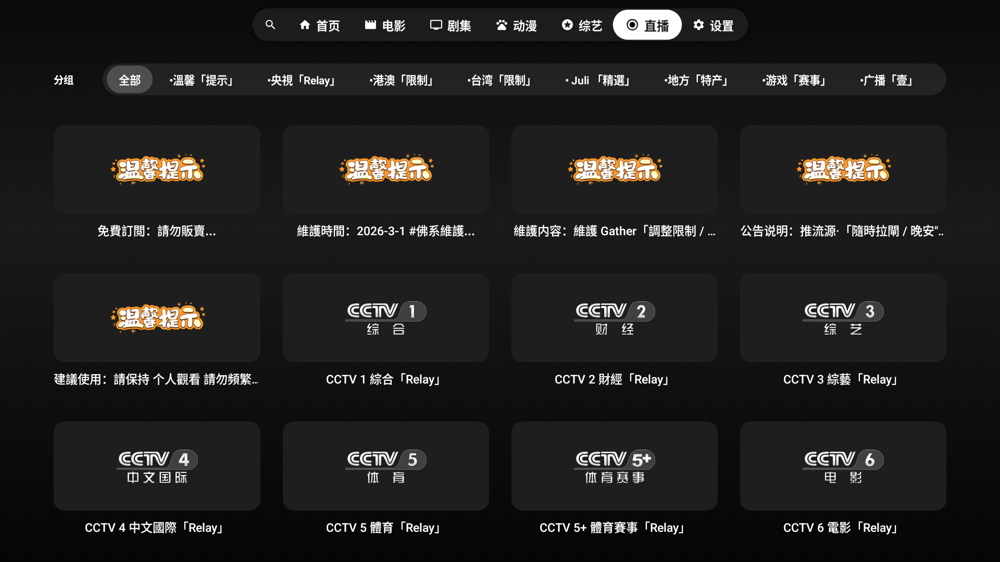

# Selene-TV

<div align="center">
  
</div>

> 📺 **Selene-TV** 是以 [MoonTV](https://github.com/MoonTechLab/LunaTV) / [Helios](https://github.com/MoonTechLab/Helios) 为后端的 **Android TV（Leanback）客户端**，在保证原汁原味的同时，针对大屏与遥控器操作做了沉浸式重构。它基于 **Kotlin + Jetpack Compose for TV** 构建，使用 **ExoPlayer (Media3)** 播放，并内置手机扫码遥控。

<div align="center">


-3DDC84?logo=androidtv&logoColor=white)
-FF5722)


</div>

<details>
  <summary>点击查看应用截图</summary>
  <br>
  
  
  
  
  
</details>

### 请不要在 B站、小红书、微信公众号、抖音、今日头条或其他中国大陆社交平台发布视频或文章宣传本项目，不授权任何"科技周刊/月刊"类项目或站点收录本项目。

---

## ✨ 功能特性

### 🎯 核心功能
- **多源聚合搜索** —— 多个视频源并发聚合，快速定位想看的内容
- **分类浏览** —— 电影、剧集、动漫、综艺、直播，分类与地区筛选一应俱全
- **动漫每日放送** —— Bangumi 风格的番剧周表，按星期追番
- **继续观看 / 我的收藏** —— 自动记录播放进度断点续播，卡片长按管理
- **直播频道** —— 央视、卫视、地方、赛事等分类直播
- **手机扫码遥控** —— 内置 Web 服务器，手机扫码即可当遥控器与输入法

### 🎨 用户体验
- **影院级详情页** —— Apple TV 式全屏 Hero（接入 TMDB 剧照 / Logo），失败自动回退
- **深色沉浸 UI** —— 纯深色、内容优先的设计，玻璃拟态与柔和聚焦动效
- **D-pad 原生导航** —— 完全为遥控器设计，聚焦清晰、滚动流畅
- **1080p 设计基准** —— 自动适配 4K，dp 尺寸一套到底

### 🔧 技术特性
- **ExoPlayer (Media3) 播放** —— HLS / MP4 原生支持，自适应码率，自动判别格式
- **元数据增强** —— 接入豆瓣 / Bangumi / TMDB，封面、评分、剧照、续作信息
- **智能缓存** —— 豆瓣数据与图片内存 + 磁盘双层缓存
- **自签证书友好** —— 兼容自托管后端常见的明文 HTTP 与自签 TLS

## 📱 支持平台

- **Android TV (Leanback)** —— 最低支持 Android 6.0 (API 23)，targetSdk 36
- 仅支持 **D-pad 遥控器** 操作，无触摸 / 鼠标依赖

## 📥 下载安装

前往 [Releases](https://github.com/MoonTechLab/Selene-TV/releases) 下载对应架构的 APK：

| 安装包 | 架构 | 适用设备 |
|--------|------|----------|
| `SeleneTV-<ver>-arm64-v8a.apk` | **armv8** (arm64-v8a) | 64 位 ARM，主流 Android TV / 电视盒子 |
| `SeleneTV-<ver>-armeabi-v7a.apk` | **armv7a** (armeabi-v7a) | 32 位 ARM，较老设备 |

> 不确定架构时优先选 **arm64-v8a**。可用 `adb install` 或文件管理器侧载安装。

## 📖 使用说明

### 首次使用
1. 启动后若未登录，会进入登录页，填写 MoonTV / Helios 后端地址与凭据
2. 登录成功后进入主界面，顶部为分类标签栏
3. 在「设置」中可查看**手机遥控二维码**、配置豆瓣 / TMDB 数据源、清理缓存

### 主要功能
- **首页** —— 继续观看、我的收藏与推荐
- **搜索** —— 多源聚合，支持手机输入法远程输入
- **分类** —— 电影 / 剧集 / 动漫 / 综艺 按筛选浏览，直播按频道分类
- **详情页** —— 查看剧照、简介、选集与播放源，一键播放

## 🏗️ 技术架构

- **Kotlin 2.2** —— 开发语言
- **Jetpack Compose for TV (Material3)** —— 声明式 TV UI 框架
- **ExoPlayer (Media3)** —— HLS / MP4 播放后端
- **Ktor (Netty)** —— 内嵌 HTTP 服务器，承载手机遥控
- **Coil** —— 图片加载与缓存（含豆瓣防盗链处理）
- **OkHttp** —— 网络请求（信任自签证书）
- **kotlinx.serialization** —— JSON 解析
- **qrcode-kotlin** —— 遥控二维码生成

## 🚀 构建与发布

本仓库通过 GitHub Actions 自动构建：推送 `v*` 形式的 tag 即会拉取源码仓库、构建按 ABI 分包的 release APK，并发布到本仓库 Release。

```bash
git tag v1.0.0
git push origin v1.0.0
```

需在 **Settings → Secrets and variables → Actions** 配置以下 Secrets：

| Secret | 必需 | 说明 |
|--------|------|------|
| `PULL_TOKEN` | ✅ | 可读取私有源码仓库的 PAT（`Selene-TV-source` Contents: Read） |
| `KEY_STORE_PASSWORD` | ✅ | keystore 密码 |
| `KEY_PASSWORD` | ✅ | key 密码 |
| `ALIAS` | ✅ | key 别名 |
| `SIGNING_KEY` | ⬜ | 可选，base64 编码的 keystore，用于覆盖源码内已提交的 `key.jks` |

> **签名稳定性**：源码仓库已提交 `key.jks`，CI 默认用它签名，每次 Release 使用同一签名，满足 Android 覆盖升级要求。仅当需要更换签名时才设置 `SIGNING_KEY`。

## ⚠️ 免责声明

1. **仅供学习交流** —— 本项目仅用于技术学习与交流，不提供任何商业服务。
2. **内容来源** —— 应用聚合的内容来源于第三方平台，我们不对内容的合法性、准确性、完整性或可用性承担任何责任。
3. **版权声明** —— 所有影视内容版权归原作者与版权方所有，请用户自觉遵守相关法律法规，支持正版。
4. **使用风险** —— 用户使用本应用所产生的任何直接或间接损失，开发者不承担任何责任。
5. **合规使用** —— 请在使用过程中遵守当地法律法规，不得用于任何违法用途。

**使用本应用即表示您已阅读并同意上述免责声明。**

## 🙏 致谢

- [MoonTV](https://github.com/MoonTechLab/LunaTV) / [Helios](https://github.com/MoonTechLab/Helios) —— 后端服务支持
- [Selene](https://github.com/MoonTechLab/Selene) —— 同系列移动端 / 桌面端客户端
- [AndroidX Media3](https://github.com/androidx/media) —— 播放器内核
- 所有用户的支持

---

<div align="center">
  <p>如果这个项目对您有帮助，请给个 ⭐️ 支持一下！</p>
</div>

[](https://www.star-history.com/#MoonTechLab/Selene-TV&Date)
